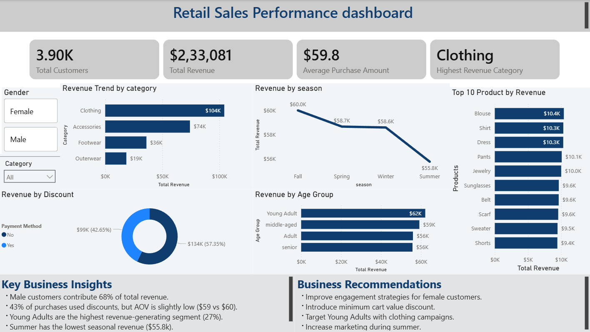

# 🛍 Retail Sales Analysis Project

## 📌 Project Overview
This project analyzes retail customer purchase behavior to uncover revenue trends, customer segmentation insights, and product performance patterns.  
The analysis was performed using **SQL, Python (Pandas), and Power BI**.

The objective was to derive actionable business insights and present them through an interactive dashboard.

---

## 🛠 Tools & Technologies Used
- **SQL** – Data analysis & business queries
- **Python (Pandas)** – Data cleaning & preprocessing
- **Power BI** – Interactive dashboard & visualization
- **CSV Dataset** – Source data (Kaggle)

---

## 📂 Project Structure

```
retail-sales-analysis
│
├── data/
│   ├── raw_data.csv
│   └── cleaned_data.csv
│
├── sql/
│   └── retail_analysis_queries.sql
│
├── python/
│   └── data_cleaning.ipynb
│
├── dashboard/
│   ├── retail_sales_dashboard.pbix
│   └── dashboard_overview.png
│
└── README.md
```

---

## 📊 Key Business Insights

- Male customers contribute **68% of total revenue**.
- 43% of purchases are made using discounts.
- Young Adults generate the highest revenue (27% contribution).
- Clothing is the highest revenue-generating category.
- Summer has the lowest seasonal revenue.

---

## 💡 Business Recommendations

- Improve engagement strategies for female customers.
- Introduce minimum cart value discount offers.
- Target young adults with clothing-focused campaigns.
- Increase marketing efforts during summer season.

---

## 📈 Dashboard Preview



---

## 🚀 Skills Demonstrated

✔ Data Cleaning using Pandas  
✔ SQL Aggregations & Subqueries  
✔ Revenue & Segmentation Analysis  
✔ Business Insight Generation  
✔ Dashboard Design in Power BI  

---

## 🎯 Project Objective

To simulate a real-world retail business scenario and demonstrate end-to-end Data Analyst workflow:
1. Data Cleaning
2. SQL Analysis
3. Insight Extraction
4. Dashboard Reporting
5. Business Recommendations

---

### 👨‍💻 Author
Akshay Sharma  
Aspiring Data Analyst
